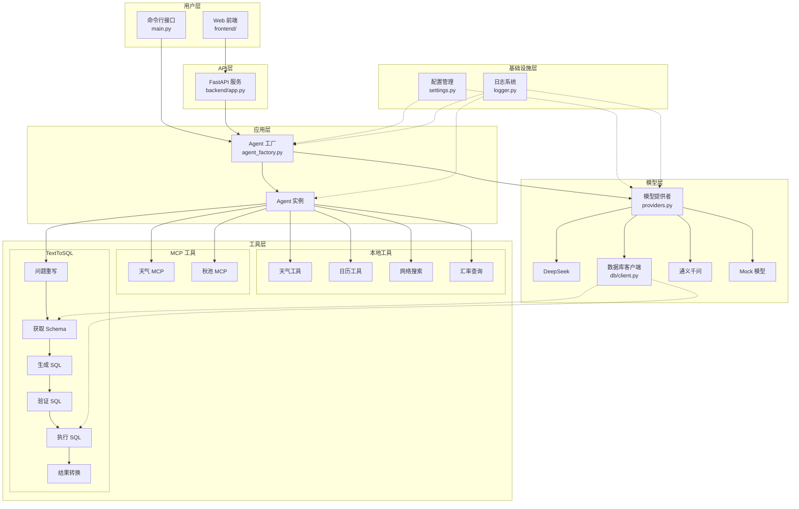

# x-langchain

> LangChain 学习与实践项目 - 构建生产级 LLM 应用的最佳实践指南

`x-langchain` 是一个完整的 LangChain 学习与实践项目，旨在帮助开发者系统学习和掌握 LangChain 框架的核心概念与应用方法。本项目通过实际案例展示如何使用 LangChain 构建大语言模型应用，包括模型集成、工具调用、上下文管理等关键功能，为 LangChain 初学者和进阶开发者提供实践参考。

**核心价值**：开箱即用的多模型支持、插件化工具系统、完整的 TextToSQL 解决方案、前后端分离架构

**适用场景**：智能客服、数据查询助手、企业知识库问答、LLM 应用原型开发

---

## 什么是 LangChain？

- **官方定义**："LangChain is a framework for developing applications powered by large language models"
- **Gartner 描述**："LLM application development frameworks like LangChain"

简单来说，`LangChain` 是一个帮助开发者快速构建基于大语言模型（LLM）应用的开发框架。

---

## 核心特性

- **多模型兼容** - 支持 DeepSeek、豆包、阿里云通义千问等主流 LLM 后端
- **工具调用（Function Calling）** - 通过声明式接口集成外部 API 与业务系统
- **TextToSQL 功能** - 支持自然语言到 SQL 的转换，包括问题重写、Schema 解析、SQL 生成、验证和执行
- **MCP 协议支持** - 集成 Model Context Protocol，支持 MCP 工具调用
- **上下文管理** - 内置对话历史管理，支持连续对话
- **安全合规** - API 密钥管理（从环境变量加载，避免硬编码）、输入/输出内容过滤
- **可观测性** - 集成结构化日志系统，便于监控和调试
- **插件化架构** - 基于装饰器的工具自动注册，支持热插拔
- **前后端分离** - 提供完整的 Web 前端界面和 RESTful API 服务

---

## 技术栈

| 类别 | 技术 |
|------|------|
| **核心框架** | LangChain, LangGraph |
| **模型集成** | langchain-openai, langchain-community, dashscope |
| **配置管理** | pydantic-settings, python-dotenv |
| **工具库** | duckduckgo-search, sqlalchemy, pymysql |
| **MCP 协议** | langchain-mcp-adapters |
| **日志系统** | loguru |
| **后端服务** | FastAPI, Uvicorn |
| **前端技术** | HTML5, CSS3, JavaScript (ES6+) |
| **包管理** | uv / pip |
| **部署** | Docker |

---

## 项目结构

```
x-langchain/
├── src/                                # 源代码目录
│   ├── main.py                         # 项目主入口，CLI 交互接口
│   ├── core/                           # 核心模块
│   │   ├── config.py                   # 配置类，环境变量加载
│   │   └── logger.py                   # 日志系统
│   ├── constants/                      # 常量模块
│   │   ├── develop.py                  # 开发相关常量
│   │   └── streaming_modes.py          # 流式传输模式
│   ├── models/                         # 模型管理模块
│   │   └── providers.py                # 模型提供者与统一模型创建入口
│   ├── agents/                         # Agent 模块
│   │   ├── agent.py                    # LangGraph Agent 定义
│   │   └── agent_factory.py            # Agent 工厂
│   ├── tools/                          # 工具模块
│   │   ├── weather_tool.py             # 天气查询（高德地图 API）
│   │   ├── calendar_tool.py            # 日历查询
│   │   ├── web_tool.py                 # 网络搜索（DuckDuckGo）
│   │   ├── exchange_rate_tool.py       # 汇率查询
│   │   ├── qiuchi_mcp/                 # 秋池 MCP 工具包
│   │   └── text_to_sql/                # TextToSQL 工具链
│   │       ├── question_rewrite_tool.py
│   │       ├── get_schema_tool.py
│   │       ├── generate_sql_tool.py
│   │       ├── validate_sql_tool.py
│   │       ├── execute_sql_tool.py
│   │       └── convert_to_natural_language_tool.py
│   └── clients/                        # 客户端模块
│       └── db/                         # 数据库客户端
│           └── client.py
├── backend/                            # 后端 API 服务
│   └── app.py                          # FastAPI 服务入口
├── frontend/                           # 前端界面
│   ├── index.html                      # HTML 入口
│   ├── script.js                       # JavaScript 逻辑
│   └── style.css                       # 样式文件
├── tests/                              # 测试模块
├── docs/                               # 文档目录
├── examples/                           # 示例代码
├── .env.example                        # 环境变量配置示例
├── pyproject.toml                      # 项目元数据和依赖
├── Dockerfile                          # Docker 构建文件
└── README.md                           # 项目文档
```

---

## 系统架构

### 分层架构图



---

## 快速开始

### 环境要求

| 环境 | 要求 |
|------|------|
| **Windows** | Python 3.11+, 推荐使用 PowerShell 或 Git Bash |
| **Linux/macOS** | Python 3.11+, 任意 Shell |

> 推荐使用 [`uv`](https://github.com/astral-sh/uv) 作为包管理器，亦可兼容 `pip`

### 项目克隆

```bash
git clone https://gitee.com/chain-engine/x-langchain.git
cd x-langchain
```

### 依赖安装

```bash
# 使用 uv（推荐）
uv sync

# 或使用 pip
pip install -e .

# 安装后端依赖（FastAPI）
pip install fastapi uvicorn
```

### 配置文件创建

```bash
# 复制配置模板
cp .env.example .env
```

编辑 `.env` 文件，配置必要的 API 密钥：

```env
# DeepSeek API（推荐）
MODEL_NAME=deepseek
DEEPSEEK_API_KEY=sk-xxxxxxxxxxxxxxxxxxxxxxxxxxxxxxxx
DEEPSEEK_API_BASE=https://api.deepseek.com/v1
DEEPSEEK_MODEL_NAME=deepseek-chat

# 或豆包 API
# MODEL_NAME=doubao
# DOUBAO_API_KEY=xxxxxxxx-xxxx-xxxx-xxxx-xxxxxxxxxxxx
# DOUBAO_API_BASE=https://ark.cn-beijing.volces.com/api/v3
# DOUBAO_MODEL_NAME=ep-xxxxxxxxxxxxxx

# 或阿里云通义千问
# MODEL_NAME=tongyi
# ALIYUN_API_KEY=sk-xxxxxxxxxxxxxxxxxxxxxxxxxxxxxxxx
# ALIYUN_MODEL_NAME=qwen-plus

# 通用配置
TEMPERATURE=0.0
DEBUG=True

# 数据库配置（TextToSQL 功能需要）
# DB_HOST=localhost
# DB_PORT=3306
# DB_USER=root
# DB_PASSWORD=your_password
# DB_NAME=your_database
```

### 启动方式

#### 方式一：命令行交互模式

```bash
# 使用默认模型（DeepSeek）
uv run src/main.py

# 或使用已安装的命令行入口
uv run x-langchain

# 通过环境变量指定模型
MODEL_NAME=deepseek uv run src/main.py
MODEL_NAME=doubao uv run src/main.py
MODEL_NAME=tongyi uv run src/main.py
```

#### 方式二：后端 API 服务

```bash
# 启动后端服务（端口 8001）
python backend/app.py
```

#### 方式三：前端界面

```bash
# 启动前端静态文件服务（端口 8080）
cd frontend
python -m http.server 8080
```

#### 方式四：Docker 启动

```bash
# 构建镜像
docker build -t x-langchain:latest .

# 运行容器（挂载配置和日志目录）
docker run -it --rm \
  -v $(pwd)/.env:/app/.env:ro \
  -v $(pwd)/logs:/app/logs \
  x-langchain:latest

# Windows PowerShell
docker run -it --rm `
  -v ${PWD}/.env:/app/.env:ro `
  -v ${PWD}/logs:/app/logs `
  x-langchain:latest
```

### 常用命令

```bash
# 运行测试
uv run python -m pytest

# 运行特定测试模块
uv run python -m pytest tests/test_providers.py -v

# 代码格式化（如果安装了 ruff）
uv run ruff format .

# 类型检查（如果安装了 pyright）
uv run pyright
```

---

## 使用方法

### 交互式对话模式

启动程序后，进入交互式对话模式：

```bash
$ uv run src/main.py

==================================================
欢迎使用智能助手！输入 'exit'、'quit' 或 '退出' 结束对话
==================================================

你: 上海天气怎么样？

2026-03-05 10:00:00,123 - INFO - 查询结果:
上海今天多云，气温 18°C，东风 3级，湿度 65%，空气质量良好。

你: 帮我查询数据库中的用户数量

2026-03-05 10:01:00,456 - INFO - 查询结果:
根据数据库查询，当前系统中有 150 个用户。

你: exit

感谢使用，再见！
```

### Web 前端界面

1. 启动后端服务：`python backend/app.py`
2. 启动前端服务：`cd frontend && python -m http.server 8080`
3. 在浏览器中访问：`http://localhost:8080`

前端功能特性：
- 🎨 现代化深色主题 UI 设计
- 💬 实时流式聊天响应
- ⚡ 快捷功能卡片（写文章、写代码、SQL 查询、网络搜索）
- 💾 对话历史保存（本地存储 + JSON 导出）
- 📱 响应式设计，支持移动端

### API 接口

| 接口 | 方法 | 说明 |
|------|------|------|
| `/` | GET | 服务状态 |
| `/health` | GET | 健康检查 |
| `/chat` | POST | 非流式聊天 |
| `/chat/stream` | POST | 流式聊天 |

**请求示例**：

```bash
# 健康检查
curl http://localhost:8001/health

# 非流式聊天
curl -X POST http://localhost:8001/chat \
  -H "Content-Type: application/json" \
  -d '{"message": "你好"}'

# 流式聊天
curl -X POST http://localhost:8001/chat/stream \
  -H "Content-Type: application/json" \
  -d '{"message": "介绍一下你自己"}'
```

### 模型选择

通过环境变量 `MODEL_NAME` 指定模型：

| 模型 | 环境变量 | 说明 |
|------|---------|------|
| DeepSeek | `MODEL_NAME=deepseek` | 默认模型，性价比高 |
| 豆包 | `MODEL_NAME=doubao` | 字节跳动出品 |
| 通义千问 | `MODEL_NAME=tongyi` | 阿里云出品 |
| Mock | `MODEL_NAME=mock` | 本地模拟模型，无需 API Key |

```bash
# 使用 DeepSeek（默认）
uv run src/main.py

# 使用豆包
MODEL_NAME=doubao uv run src/main.py

# 使用通义千问
MODEL_NAME=tongyi uv run src/main.py

# 使用 Mock 模型（无需 API Key）
MODEL_NAME=mock python backend/app.py
```

---

## 插件化工具系统

x-langchain 提供插件化的工具管理系统，开发者可轻松添加新工具，无需修改核心代码。

### 核心特性

- **自动注册** - 使用 `@register_tool` 装饰器自动注册工具
- **工具发现** - 自动扫描 `tools/` 目录，发现新工具
- **类别管理** - 按类别组织工具，便于管理和过滤
- **向后兼容** - 完全兼容现有工具代码

### 快速开始

创建新工具只需三步：

```python
# 1. 在 tools/ 目录下创建新文件
# tools/my_tool.py

# 2. 使用装饰器注册工具
from tools.registry import register_tool

@register_tool(name="my_tool", category="custom", description="我的工具")
class MyTool:
    def __init__(self):
        self.name = "my_tool"
        self.description = "我的自定义工具"

    def run(self, param: str) -> str:
        return f"处理参数: {param}"

# 3. 完成！工具会在模块导入时自动注册
```

### 工具查询

```python
from tools import ToolRegistry

# 检查工具是否存在
if ToolRegistry.contains("my_tool"):
    tool = ToolRegistry.get("my_tool")

# 获取所有工具
all_tools = ToolRegistry.get_all()

# 按类别获取工具
custom_tools = ToolRegistry.get_all(category="custom")

# 获取统计信息
stats = ToolRegistry.get_stats()
print(f"总工具数: {stats['total_tools']}")
```

> 详细文档请参考 [插件开发指南](docs/插件开发指南.md)

---

## 许可证

本项目采用 MIT 许可证，详见 [LICENSE](LICENSE) 文件。

---

## 参考资料

- [LangChain 官方文档](https://python.langchain.com/docs/get_started/introduction)
- [LangChain 中文文档](https://langchain-doc.cn/v1/python/langchain/overview.html)
- [FastAPI 官方文档](https://fastapi.tiangolo.com/)
- [Python 官方文档](https://docs.python.org/3/)
- [uv 包管理器](https://github.com/astral-sh/uv)
- [DeepSeek 官方文档](https://platform.deepseek.com/docs/api)
- [豆包官方文档](https://www.doubao.com/)
- [阿里云通义千问](https://help.aliyun.com/product/1081203.html)

---

## 联系方式

| 项目 | 信息 |
|------|------|
| **作者** | John Young（夜雨诗来） |
| **邮箱** | john.young@foxmail.com |
| **Gitee** | https://gitee.com/yeyushilai |
| **GitHub** | https://github.com/yeyushilai |
| **项目地址** | https://gitee.com/chain-engine/x-langchain |
| **GitHub** | https://github.com/StephenCurry429/langchain |